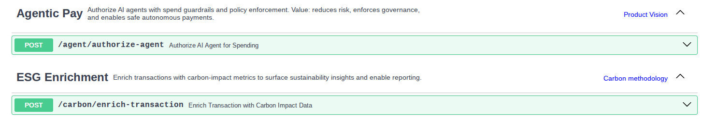
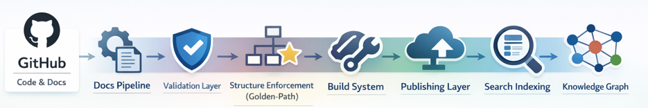
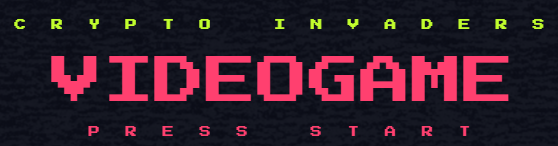
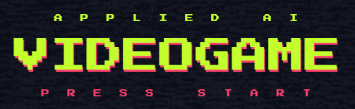

# Fiona Keegan | Technical Writer and Content Strategist

**Turning complexity into clarity.**

I bridge complex technical products and user success through clear, scalable documentation.

Currently at Mastercard, specializing in docs for **DevOps, APIs, and self-service enablement**.

## 📍 Quick Links

* [📊 Impact](#impact)
* [🛠️ Tools](#tools)
* [📂 Product Docs](#product-docs)
* [🚀 Prototypes](#prototypes)
* [🧠 Strategy and Enablement](#strategy)
* [🎨 Content Design](#content-design)
* [🕹️ Gamified Learning](#gamified)
* [🔗 LinkedIn Profile](https://www.linkedin.com/in/fiona-keegan-b51538150/)

##  📊 Impact

- Led documentation strategy for an internal developer platform serving **5000+ engineers**.
- Established content governance framework and review processes, **reducing publication cycles by ~40%**.
- Created technical writing enablement training supporting **50+ contributors** across multiple teams.
- Mentored **1 junior and 2 mid-level technical writers** on documentation best practices and modern tooling.
- Drove **docs-as-code adoption**, migrating legacy content to modern SSG infrastructure for **100+ products**.
- Empowered developers to self-serve, **improving onboarding time and reducing support requests by ~35%**.

##  🛠️ Tools

- **Languages:** Markdown, HTML, SQL, Python (FastAPI)
- **Tools:** GitHub, GitHub Copilot, Hugo, Power BI, VS Code, Azure DevOps, Jira, Figma
- **Specialties:** Developer user guides, content as infrastructure 

##  📂 Product Docs

<strong>Note:</strong> These samples are exported PDF versions of documentation hosted on a developer portal. The live environment used a <strong>Static Site Generator (SSG)</strong> to manage styling; these versions are converted to focus on content and structure.

### [Apache Cassandra - Overview](./assets/apache-cassandra.pdf)

*Overview of Apache Cassandra that delivers a highly scalable, distributed NoSQL data store with tunable consistency for high‑availability, multi‑region applications.*

### [My Data - Overview](./assets/my-data.pdf)

*Overview of a customer‑facing privacy platform that enables individuals to securely exercise their data rights while supporting global data protection compliance.*

### [Data Platform - Overview](./assets/big-data-cluster.pdf)

*Overview of an enterprise data analytics platform that enables scalable analysis of large transaction datasets to support business insights and decision‑making.*

### [Spacewalk - Oracle Linux Manager](./assets/spacewalk.pdf)

*Guidance for engineering teams on systems management. This content was created to ensure consistent environment configuration across the organization.*

### [HashiCorp Vault - Overview](./assets/hashicorp-vault.pdf)

*This snippet is from a product landing page. The full document includes detailed information on APIs, use cases with mermaid diagrams, tutorials and guides, integration mechanisms, and support specifically tailored for internal engineering teams.*

### [SoftCo - Admin User Guide](./assets/admin-user-guide.pdf)

*This document was one of the first comprehensive product guides I created in 2019, aimed at non-technical enterprise users. It was developed using a CMS before the organization adopted a docs-as-code approach.*

##  🚀 Prototypes

<strong>Note:</strong> First load may take between <strong>30 and 60 seconds</strong>.

### [Prototypes - APIs](https://open-finance-prototypes.onrender.com/docs)

*These API prototypes were built to explore FastAPI and modern Python development practices. They demonstrate two emerging fintech concepts: AI agent authorization with spending guardrails, and real-time ESG transaction enrichment. The project showcases RESTful API design, OpenAPI documentation, and gateway routing patterns.*

##  🧠 Strategy and Enablement

<strong>Important:</strong> These materials were developed for <strong>internal strategy planning and enablement</strong>. The tone and formatting prioritize information density and internal knowledge-sharing over the high-polish aesthetic of end-user guides.

### [Scaling AI Readiness with Knowledge Architecture](./assets/scaling-ai-readiness-knowledge-architecture.pdf)

*Technical vision outlining how Knowledge Architecture transforms documentation into AI‑ready infrastructure to improve accuracy, velocity, and governance.*

### [Knowledge Orchestration with Copilot](./assets/knowledge-orchestration-copilot.pdf)

*A deep dive into how to orchestrate an end-to-end content workflow with Copilot.*

### [Content Strategy 101: Tech Writing Training](./assets/tech-writing-training.pdf)

*This training was developed for tech writers, engineers, and product managers to help them contribute to a global knowledge hub. As this was intended for an internal audience, most links are not accessible externally. 
The content was designed to be informal and engaging.*

##  🎨 Content Design

### [Engineering Platform - Overview](./assets/platform-overview.pdf)

*This diagram illustrates the key components of a product engineering platform designed for developers. Comprehensive user documentation, including onboarding instructions and how-to guides for each application, was created from scratch.*

### [SoftCo - Website Copy](./assets/ux-copy-p2p.pdf)

*Samples of content I created for a product website to provide an overview of a Procure-to-Pay SaaS platform. The sample includes detailed information on the platform, highlighting its features, benefits, and value proposition.*

### [SoftCo - UI Text](./assets/ui-text-p2p.pdf)

*Comprehensive UI string development. I focused on reducing user friction by standardizing navigation, tooltips, and error messaging across the platform.*

##  🕹️ Gamified Learning

### [Crypto Invaders](https://view.genially.com/66700292a6e99700148f136e/interactive-content-crypto-invaders)

*A beginner's guide to learning the fundamentals of cryptocurrency.*

### [Applied AI in Fintech](https://view.genially.com/66713fd5aa1c3700144ff511/interactive-content-applied-ai)

*A beginner's guide to learning the fundamentals of Applied AI in Fintech.*    

[↑ Back to top](#top) | [🔗 LinkedIn Profile](https://www.linkedin.com/in/fiona-keegan-b51538150/)