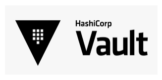

# Fiona Keegan | Technical Writer and Content Strategist

I turn complexity into clarity.

I bridge the gap between complex technical products and user success.

Currently at **Mastercard**, specializing in docs for **DevOps, APIs, and self-service enablement**.

## 📍 Quick Links

* [🛠️ Tools](#tools)
* [📂 Product Docs](#product-docs)
* [🎨 Content Design](#content-design)
* [🧠 Strategy and Enablement](#strategy)
* [🕹️ Gamified Learning](#gamified)

##  🛠️ Tools

- **Languages:** Markdown, HTML, SQL, Python (FastAPI)
- **Tools:** GitHub, GitHub Copilot, Hugo, Power BI, VS Code, Azure DevOps, Jira, Figma
- **Specialties:** Developer User Guides, Content-as-Infrastructure

##  📂 Product Docs

<strong>Note:</strong> These samples are exported PDF versions of documentation hosted on a developer portal. The live environment used a <strong>Static Site Generator (SSG)</strong> to manage styling; these versions are converted to focus on content and structure.

### [Spacewalk - Oracle Linux Manager](./assets/spacewalk.pdf)

*Guidance for engineering teams on systems management. This content was created to ensure consistent environment configuration across the organization.*

### [HashiCorp Vault - Overview](./assets/hashicorp-vault.pdf)

*This snippet is from a product landing page. The full document includes detailed information on APIs, use cases with mermaid diagrams, tutorials and guides, integration mechanisms, and support specifically tailored for internal engineering teams.*

### [SoftCo - Admin User Guide](./assets/admin-user-guide.pdf)

*This document was one of the first comprehensive product guides I created in 2019, aimed at non-technical enterprise users. It was developed using a CMS before the organization adopted a docs-as-code approach.*

##  🎨 Content Design

### [Engineering Platform - Overview](./assets/platform-overview.pdf)
*This diagram illustrates the key components of a product engineering platform designed for developers. Comprehensive user documentation, including onboarding instructions and how-to guides for each application, was created from scratch.*

### [SoftCo - Website Copy](./assets/ux-copy-p2p.pdf)
*Samples of content I created for a product website to provide an overview of a Procure-to-Pay SaaS platform. The sample includes detailed information on the platform, highlighting its features, benefits, and value proposition.*

### [SoftCo - UI Text](./assets/ui-text-p2p.pdf)
*Comprehensive UI string development. I focused on reducing user friction by standardizing navigation, tooltips, and error messaging across the platform.*

##  🧠 Strategy and Enablement

<strong>Important:</strong> These materials were developed for <strong>internal enablement</strong>. The tone and formatting prioritize information density and internal knowledge-sharing over the high-polish aesthetic of end-user guides.

### [Knowledge Orchestration with Copilot](./assets/knowledge-orchestration-copilot.pdf)
*A deep dive into how to orchestrate an end-to-end content workflow with Copilot.*

### [Content Strategy 101: Tech Writing Training](./assets/tech-writing-training.pdf)
*This training was developed for tech writers, engineers, and product managers to help them contribute to a global knowledge hub. As this was intended for an internal audience, most links are not accessible externally. 
The content was designed to be informal and engaging.*

##  🕹️ Gamified Learning

### [Crypto Invaders](https://view.genially.com/66700292a6e99700148f136e/interactive-content-crypto-invaders)
*A beginner's guide to learning the fundamentals of cryptocurrency.*

### [Applied AI in Fintech](https://view.genially.com/66713fd5aa1c3700144ff511/interactive-content-applied-ai)
*A beginner's guide to learning the fundamentals of AAI in Fintech.*    

[↑ Back to top](#top)