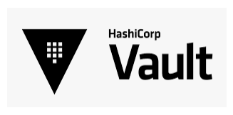
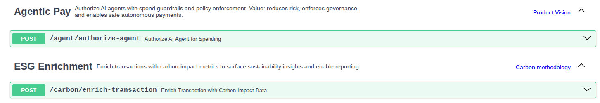
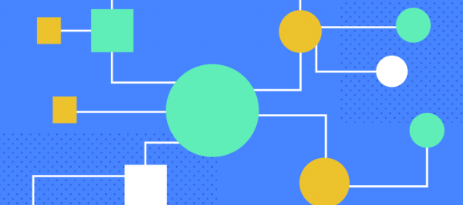
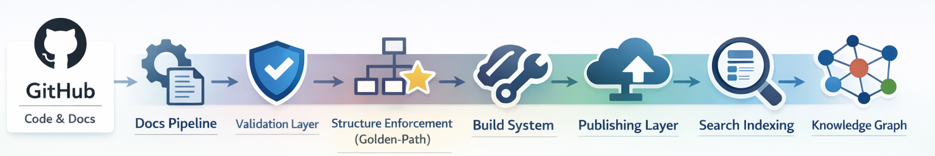
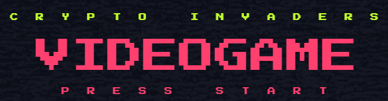
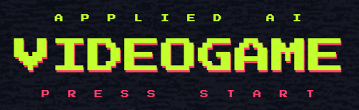

# Fiona Keegan | Technical Writer | Content Strategist

*Enterprise systems • Developer experience • AI‑ready knowledge architecture*

**Turning complexity into clarity.**

I bridge complex technical products and user success through clear, scalable content.

Currently at Mastercard, specializing in content for **DevOps, APIs, and self-service enablement**.

## 📍 Quick Links

* [📊 Impact](#impact)
* [🛠️ Tools](#tools)
* [📂 Product Docs](#product-docs)
* [🎨 Content Design](#content-design)
* [🚀 Prototypes](#prototypes)
* [🧠 Strategy and Enablement](#strategy)
* [🕹️ Gamified Learning](#gamified)
* [🔗 LinkedIn Profile](https://www.linkedin.com/in/fiona-keegan-b51538150/)

##  📊 Impact

- Led content strategy for an internal developer platform serving **5,000+ engineers**.
- Designed structured content for an LLM-driven knowledge system:
    - **Improved search accuracy by ~65%** through semantic chunking and metadata optimization.
    - **Reduced repeated support requests by ~40%** through accurate self‑service content.
- Drove **docs-as-code adoption**, migrating legacy content to modern infrastructure for **100+ products**.
- Created content enablement training supporting **25+ contributors** across multiple teams.
- Mentored **1 junior and 2 mid-level content strategists** on best practices and modern tooling.

##  🛠️ Tools

- **Languages:** Markdown, HTML, SQL, Python (FastAPI)
- **Tools:** GitHub, GitHub Copilot, Hugo, Power BI, VS Code, Azure DevOps, Jira, Figma
- **Specialties:** Developer content, content as infrastructure, knowledge architecture 

##  📂 Product Docs

<strong>Note:</strong> These samples are exported PDF versions of documentation hosted on a developer portal. The live environment used a <strong>Static Site Generator (SSG)</strong> to manage styling; these versions are converted to focus on content and structure.

### [Product Onboarding Assistant - Overview](./assets/poa.pdf)

*End-to-end documentation for an LLM-powered onboarding assistant using RAG and vector search. Created comprehensive guides covering system architecture, AI components (embeddings, retrieval, fine-tuning), human-in-the-loop workflows, and multi-role usage patterns. Includes architecture diagrams, conceptual AI explanations, and practical tutorials for product and engineering teams.*

### [Data Platform - Overview](./assets/big-data-cluster.pdf)

*Infrastructure documentation for an enterprise Hadoop cluster platform. Created end-to-end guides for engineering teams covering cluster access, Impala shell commands, query optimization, and troubleshooting workflows. Documented distributed storage architecture, data pipeline operations, and performance tuning for large-scale analytics workloads.*

### [Apache Cassandra - Overview](./assets/apache-cassandra.pdf)

*Technical overview and operational guides for Apache Cassandra distributed database. Documented NoSQL architecture, tunable consistency models, multi-region replication, and high-availability patterns for platform engineering teams.*

### [HashiCorp Vault - Overview](./assets/hashicorp-vault.pdf)

*Comprehensive documentation for HashiCorp Vault secrets management platform. Created API guides, integration tutorials, use case diagrams (Mermaid), and architectural documentation for internal engineering teams securing credentials and sensitive data across applications.*

### [My Data - Overview](./assets/my-data.pdf)

*Product overview and user documentation for a customer-facing privacy platform. Documented data rights workflows, privacy request handling, consent management, and compliance features supporting GDPR and global data protection regulations. Created for internal teams managing privacy operations.*

### [Spacewalk - Oracle Linux Manager](./assets/spacewalk.pdf)

*Systems management documentation for Oracle Linux environments. Created operational guides for engineering teams covering server provisioning, patch management, configuration standardization, and environment consistency across the organization's infrastructure.*

### [SoftCo - Admin User Guide](./assets/admin-user-guide.pdf)

*Comprehensive admin guide for a Procure-to-Pay SaaS platform. Documented system configuration, user management, workflow administration, and troubleshooting for enterprise admin users. Created using a CMS workflow prior to transitioning to docs-as-code approach.*

##  🎨 Content Design

### [Engineering Platform - Overview](./assets/platform-overview.pdf)

*Architecture diagram illustrating a product engineering platform and its components. Created comprehensive onboarding documentation and how-to guides for each platform application for internal developer teams.*

### [SoftCo - Website Copy](./assets/ux-copy-p2p.pdf)

*Website content and product overviews for a Procure-to-Pay SaaS platform. Created feature descriptions, value propositions, and user-facing copy to support product marketing and customer education.*

### [SoftCo - UI Text](./assets/ui-text-p2p.pdf)

*UI copy and microcopy for a Procure-to-Pay platform. Standardized navigation labels, tooltips, error messages, and in-app guidance to reduce user friction and improve consistency across the application.*

##  🚀 Prototypes

<strong>Note:</strong> First load may take between <strong>30 and 60 seconds</strong>.

### [Prototypes - APIs](https://open-finance-prototypes.onrender.com/docs)

*These API prototypes were built to explore FastAPI and modern Python development practices. They demonstrate two emerging fintech concepts: AI agent authorization with spending guardrails, and real-time ESG transaction enrichment. The project showcases RESTful API design, OpenAPI documentation, and gateway routing patterns.*

##  🧠 Strategy and Enablement

<strong>Important:</strong> These materials were developed for <strong>internal strategy planning and enablement</strong>. The tone and formatting prioritize information density and internal knowledge-sharing over the high-polish aesthetic of end-user guides.

### [Scaling AI Readiness with Knowledge Architecture](./assets/scaling-ai-readiness-knowledge-architecture.pdf)

*Technical vision outlining how Knowledge Architecture transforms content into AI‑ready infrastructure to improve accuracy, velocity, and governance.*

### [Knowledge Orchestration with Copilot](./assets/knowledge-orchestration-copilot.pdf)

*A deep dive into how to orchestrate an end-to-end content workflow with Copilot.*

### [Content Strategy 101: Tech Writing Training](./assets/tech-writing-training.pdf)

*This training was developed for tech writers, engineers, and product managers to help them contribute to a global knowledge hub. As this was intended for an internal audience, most links are not accessible externally. 
The content was designed to be informal and engaging.*

##  🕹️ Gamified Learning

### [Crypto Invaders](https://view.genially.com/66700292a6e99700148f136e/interactive-content-crypto-invaders)

*A beginner's guide to learning the fundamentals of cryptocurrency.*

### [Applied AI in Fintech](https://view.genially.com/66713fd5aa1c3700144ff511/interactive-content-applied-ai)

*A beginner's guide to learning the fundamentals of Applied AI in Fintech.*    

[↑ Back to top](#top) | [🔗 LinkedIn Profile](https://www.linkedin.com/in/fiona-keegan-b51538150/)